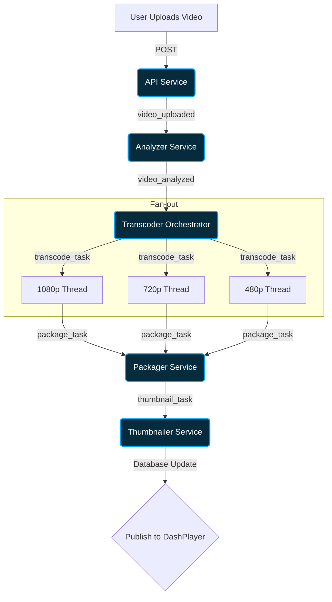

# Selkomark Video on Demand (VOD) Pipeline - OpenVOD

This project implements a scalable, event-driven microservices architecture for ingesting, analyzing, transcoding, packaging, and serving DRM-protected video content.

## Architecture Overview



The system is designed around a PubSub event-driven data pipeline. Each stage of the video's lifecycle is handled by a standalone microservice that consumes events, performs its specific processing, updates the central database state via the API, and emits the next event to continue the pipeline.

### The Pipeline Abstraction

1. **Upload & Ingest (`api` & `client`)**
   - **Action**: The user uploads a raw `.mp4` or `.mov` file via the React (`client`) frontend to the `api` service.
   - **Process**: The file is streamed straight to the storage bucket. A record is created in the PostgreSQL database with a status of `UPLOADED`.
   - **Event emitted**: `video_uploaded`

2. **Metadata Analysis (`analyzer`)**
   - **Action**: The `analyzer` service consumes `video_uploaded`.
   - **Process**: Using `ffprobe`, the service natively probes the file for width, height, duration, codec, and audio channels. This decoupling prevents the `api` node process from blocking on heavy I/O operations and guarantees accurate resolution targeting for downstream processes. The video status becomes `ANALYZING`.
   - **Event emitted**: `video_analyzed`

3. **Transcoding (`transcoder`)**
   - **Action**: The `transcoder` service acts as an orchestrator, consuming `video_analyzed`.
   - **Process**: It calculates an adaptive bitrate (ABR) ladder. If a video is 4K (2160p), it fans out parallel jobs to generate all lower renditions using `ffmpeg`. 
   - **Supported Resolutions**: 
     - `2160p` (4K, Ultra HD)
     - `1440p` (2K, QHD)
     - `1080p` (Full HD)
     - `720p` (HD)
     - `480p` (SD)
     - `360p` (Low)
   - **Caveat (Rendition Target Thresholds)**: The orchestrator will *never* upscale. If a 1080p source is uploaded, it skips 4K and 1440p generation. Be mindful that very odd source ratios (e.g., 800x600) will forcefully clamp the ladder to nearest standard sizes to avoid macroblocking artifacting.
   - **Event emitted**: `package_task` (once all individual MP4 renditions are complete)

4. **DASH Packaging & DRM (`packager`)**
   - **Action**: The `packager` consumes `package_task`.
   - **Process**: It intakes all generated standard `mp4` renditions and converts them into fragmented MP4s (`fMP4`) conforming to the DASH manifest standard (`stream.mpd`). It introduces encryption during this fragmenting phase. The status becomes `PACKAGING`. 
   - **Event emitted**: `thumbnail_task`

5. **Thumbnail Generation (`thumbnailer`)**
   - **Action**: The `thumbnailer` consumes `thumbnail_task`.
   - **Process**: Extracts 20 uniform frame captures from the first 30% of the video to construct a rich, hover-scrubbable timeline asset. The status becomes `THUMBNAILING`.
   - **Event emitted**: None. The service marks the database as `READY_TO_PUBLISH` / `PUBLISHED`.

---

## Technical Caveats & Details

### Digital Rights Management (DRM)
This pipeline deploys W3C ClearKey Encryption via Google's `shaka-packager`. 
- **Encryption Process**: Instead of standard HLS streaming, we use CENC (Common Encryption). Every single video gets its own *cryptographically unique* Key ID and Key generated dynamically. 
- **Caveat (Security vs. Complexity)**: ClearKey is an AES-128 symmetrical encryption method. While it successfully prevents trivial user-end downloading (e.g., sniffing `.mp4` URLs via developer tools), it is *not* a hardware-level DRM like Google Widevine or Apple FairPlay. Because the decryption keys are delivered in plaintext to the browser's EME (Encrypted Media Extensions) memory over an authenticated HTTPS `/api/videos/:id/drm-keys` route, highly advanced users can still dump the CENC keys. For a true enterprise solution, the API key server must be integrated with a licensing authority (like Axinom or EZDRM).

### Storage & Filesystem Limitations
- **Volume Mounts**: The pipeline relies on a shared `data/storage` Docker volume representing an NFS standard. In a production cloud scenario, the `file://` scheme must be migrated to a direct `gs://` (GCS) or `s3://` (AWS) streaming logic. 
- **Worker Concurrency**: The `transcoder` and `analyzer` utilize child process invocations. Running this stack locally will heavily consume CPU cores.

### Video Player Integration (Vidstack + dash.js)
- **Playback Architecture**: We utilize `Vidstack` mapped to a custom `dash.js` provider in the frontend.
- **Why DASH?**: Unlike standard `.mp4` `<video>` elements, DASH streams allow dynamic resolution shifting (Adaptive Bitrate) and encrypted memory playback.
- **Caveat (Initialization Timing)**: The dash.js player must be forcefully hooked into the ClearKey protection schema *before* it begins fetching the manifest. The `drm-keys` API endpoint is critical; if the keys are fetched synchronously *after* the DASH engine tries to parse the video fragments, playback will instantly crash.
- **Apple Devices**: Standard Safari on iOS historically blocks native DASH playback in favor of HLS. Since we are strictly using DASH CENC for ClearKey, playback support on mobile iOS requires `managedMediaSource` (MMS) polyfills or falling back to a non-encrypted `.mp4`. Be aware of this restriction if targeting 100% iOS mobile coverage.

---

## Local Development Context

### Accessing the App
Once Docker Compose is successfully running, open your browser to view the client UI:
**[http://localhost:5173](http://localhost:5173)**

```bash
# Install root/workspace dependencies
nvm use
bun install

# Rebuild and start fresh (Reset Database & Storage)
bun run docker:reset

# Or, start normally
bun run docker:up

# Tear down
bun run docker:down
\`\`\`